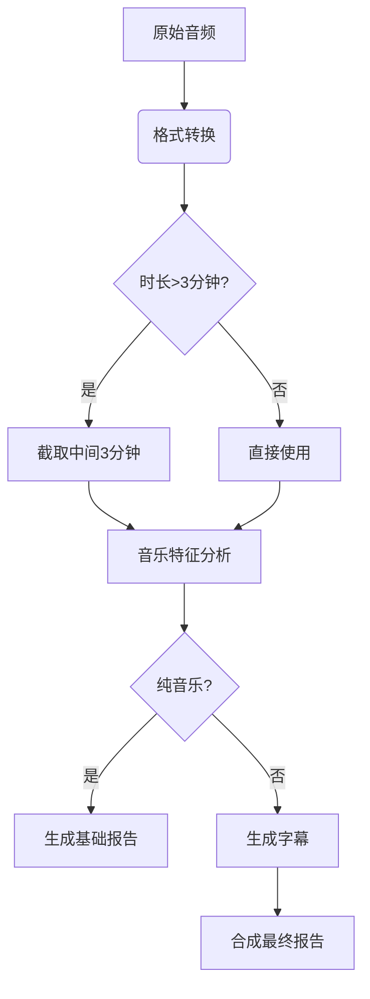

# 音乐处理模块文档

## 概述
本模块是视频处理系统的音乐处理子系统，负责：
- 音频格式标准化
- 音乐特征分析
- 字幕生成
- 最终报告合成

## 模块组成
| 文件 | 功能 |
|------|------|
| `convertmusic.py` | 音频格式转换（支持 MP3/WAV/M4A/FLAC → MP3） |
| `makemusic.py` | 音频处理（自动截取3分钟片段） |
| `knowmusic.py` | 音乐特征分析（风格/节奏/情感） |
| `is_instrumental.py` | 纯音乐检测 |
| `generate_final_report.py` | 最终报告生成 |
| `music_processor.py` | 主处理流程控制器 |

## 核心处理流程



## 输入输出
- **输入目录**: `music/MusicInput/`
  - 支持格式: MP3, WAV, M4A, FLAC
- **输出目录**:
  - 分析报告: `music/report_output/`
  - 字幕文件: `music/MucicSubtitles/`

## 运行方式
```bash
# 处理所有音乐文件
python music_processor.py
```

## 特性
1. 智能跳过已处理文件
2. 自动清理临时文件
3. 支持纯音乐/非纯音乐差异化处理
4. 集成DeepSeek API进行高级分析
